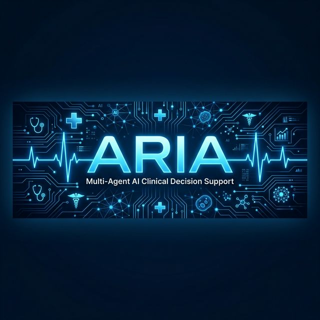

<p align="center">
  
</p>

<h1 align="center">🏥 ARIA — Autonomous Real-time Intelligence for Clinical Action</h1>

<p align="center">
  <strong>A Multi-Agent AI Clinical Decision Support System for Emergency Departments</strong>
</p>

<p align="center">
  
  
  
  
  
</p>

<p align="center">
  <em>Instead of one AI doing everything, ARIA uses multiple specialized agents that collaborate to diagnose, triage, detect bias, and explain — all in seconds.</em>
</p>

---

## 🌟 What is ARIA?

ARIA is a **multi-agent AI system** that supports clinical decision-making in emergency departments. It chains **4 specialized AI agents** in a pipeline that:

1. 🧠 **Remembers** — Retrieves patient history from past visits
2. 🔬 **Diagnoses** — Performs differential diagnosis with confidence scoring
3. 🚨 **Triages** — Assigns urgency level (Critical → Low) with reasoning
4. 💡 **Explains** — Translates all outputs into a 3-sentence doctor-friendly summary

Plus built-in **⚖️ Bias Detection** and **🌍 SDG 3 Impact Tracking**.

---

## 🤖 Agent Architecture

```
┌─────────────────────────────────────────────────────┐
│                    PATIENT INPUT                     │
│         (Voice 🎙️ or Text Form 📋)                 │
└────────────────────┬────────────────────────────────┘
                     │
          ┌──────────▼──────────┐
          │  🧠 TEMPORAL MEMORY │  ← SQLite: past visits
          │      AGENT          │     & history lookup
          └──────────┬──────────┘
                     │
          ┌──────────▼──────────┐
          │  🔬 DIAGNOSTIC      │  ← Gemini AI: differential
          │      AGENT          │     diagnosis + confidence %
          └──────────┬──────────┘
                     │
          ┌──────────▼──────────┐
          │  🟢 TRIAGE          │  ← Gemini AI: urgency level
          │      AGENT          │     + score (1-10)
          └──────────┬──────────┘
                     │
          ┌──────────▼──────────┐
          │  ⚖️ BIAS MONITOR    │  ← Rule-based: gender,
          │    (Audit Module)    │     age, income checks
          └──────────┬──────────┘
                     │
          ┌──────────▼──────────┐
          │  💡 EXPLAINABILITY   │  ← Gemini AI: 3-sentence
          │      AGENT          │     plain English summary
          └──────────┬──────────┘
                     │
┌────────────────────▼────────────────────────────────┐
│               📊 RESULTS DASHBOARD                   │
│  Diagnosis • Triage Badge • Bias Card • Timeline     │
│  Doctor Summary • SDG 3 Impact Counter               │
└─────────────────────────────────────────────────────┘
```

---

## ✨ Key Features

| Feature | Description |
|---------|-------------|
| 🎙️ **Voice Input** | Doctor speaks patient details — free Google speech-to-text transcribes |
| 🔵 **Live Agent Thinking** | Animated status shows each agent running in real-time |
| 📅 **Patient Timeline** | Horizontal visual of all past visits with triage color coding |
| ⚖️ **Bias Report Card** | Checks for gender, age, and income bias after every decision |
| 🌍 **SDG 3 Dashboard** | Live counter tracking patients triaged and bias cases flagged |
| 🌙 **Premium Dark UI** | Dark navy + electric blue theme with glassmorphism cards |

---

## 🛠️ Tech Stack

| Layer | Technology | Why |
|-------|-----------|-----|
| **Frontend** | Streamlit | Fast, Python-native, no JS needed |
| **LLM** | Google Gemini 2.5 Flash | Free tier, fast, reliable |
| **Agent Logic** | Python functions | Simple — no LangChain complexity |
| **Voice** | SpeechRecognition | Free Google speech-to-text |
| **Database** | SQLite | Zero setup, local, portable |
| **Data** | Kaggle-style medical data | 10 diverse sample patients |

---

## 🚀 Quick Start

### 1. Clone the repository
```bash
git clone https://github.com/YOUR_USERNAME/ARIA.git
cd ARIA
```

### 2. Install dependencies
```bash
pip install -r requirements.txt
```

### 3. Add your Gemini API key
Get a **free** API key at [aistudio.google.com/apikey](https://aistudio.google.com/apikey)

Create a `.env` file in the project root:
```env
GEMINI_API_KEY=your-api-key-here
```

### 4. Run the app
```bash
streamlit run app.py
```

### 5. Try it out
- ✅ Check **"Load sample patient"** in the sidebar
- 🩺 Select a patient (e.g., *Rajesh Kumar — cardiac case*)
- 🚀 Click **"Run ARIA Pipeline"**
- 📊 Watch the agents work and see the full dashboard!

---

## 📁 Project Structure

```
ARIA/
├── app.py                    # Main Streamlit dashboard
├── requirements.txt          # Python dependencies
├── .env                      # API key (not tracked by git)
├── .gitignore
│
├── agents/
│   ├── memory.py             # Temporal Memory Agent (SQLite)
│   ├── diagnostic.py         # Diagnostic Agent (Gemini)
│   ├── triage.py             # Triage Agent (Gemini)
│   ├── explainability.py     # Explainability Agent (Gemini)
│   └── pipeline.py           # Pipeline orchestrator
│
├── bias/
│   └── audit.py              # Rule-based bias detection
│
├── data/
│   └── sample_patients.csv   # 10 sample patient records
│
├── database/                  # Auto-created SQLite DBs
│
├── utils/
│   ├── voice.py              # Voice transcription
│   └── sdg_tracker.py        # SDG 3 impact counters
│
└── assets/
    └── banner.png            # README banner image
```

---

## 🧪 Sample Patients

The project includes **10 diverse patient cases** for demo:

| ID | Name | Age | Case |
|----|------|-----|------|
| P001 | Rajesh Kumar | 55 | Acute MI — chest pain, elevated troponin |
| P002 | Priya Sharma | 28 | Preeclampsia — pregnant, hypertensive |
| P003 | Ankit Mehta | 72 | Pneumonia/Sepsis — fever, low SpO2 |
| P004 | Sneha Patel | 35 | Hyperthyroidism — palpitations, low TSH |
| P005 | Mohammed Ali | 8 | Kawasaki Disease — pediatric fever + rash |
| P006 | Lakshmi Devi | 65 | Acute Stroke — sudden weakness, slurred speech |
| P007 | Vikram Singh | 42 | GI Bleed — vomiting blood, low Hb |
| P008 | Aisha Khan | 19 | Severe Asthma — wheezing, low peak flow |
| P009 | Suresh Reddy | 50 | Renal Mass — painless hematuria |
| P010 | Deepa Nair | 45 | SLE/Lupus — butterfly rash, ANA positive |

---

## 🎯 SDG 3 Alignment

ARIA is designed to advance **UN Sustainable Development Goal 3 — Good Health and Well-being**:

- **SDG 3.1** — Reduce maternal mortality (preeclampsia detection)
- **SDG 3.4** — Reduce premature mortality from NCDs (cardiac, stroke triage)
- **SDG 3.8** — Achieve universal health coverage (bias-free triage for all demographics)

The live **SDG Impact Dashboard** tracks:
- 📊 Patients triaged fairly
- ⚠️ Bias cases flagged and corrected

---

## 📄 Research Background

ARIA is the working implementation of a **published research framework** from a book chapter submitted to **CRC Press**, titled:

> *"A SDG 3-Aligned Agentic AI Framework for Explainable Clinical Decision Automation: From Diagnostics to Triage"*

The full framework describes an 8-agent system — ARIA implements the **4 core agents** essential for a working MVP.

---

## 🤝 Team

Built by two undergraduate students (CSE — AI & Data Science, 1st Year) for a hackathon.

---

## 📜 License

This project is for educational and hackathon purposes. Not intended for real clinical use.

---

<p align="center">
  <strong>Built with ❤️ and AI for better healthcare</strong>
</p>
